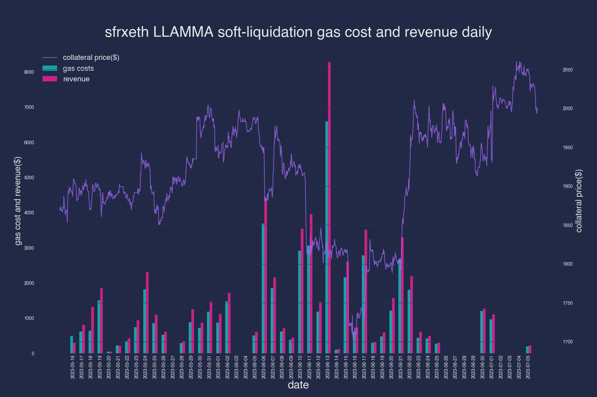
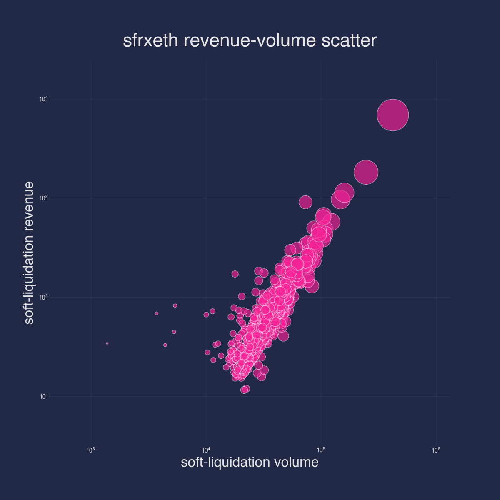
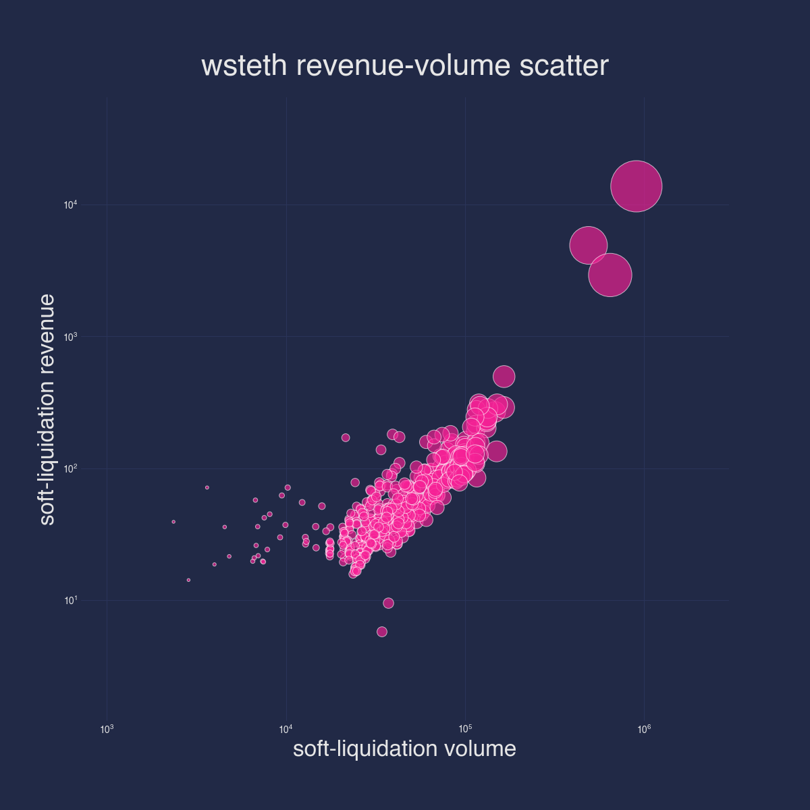
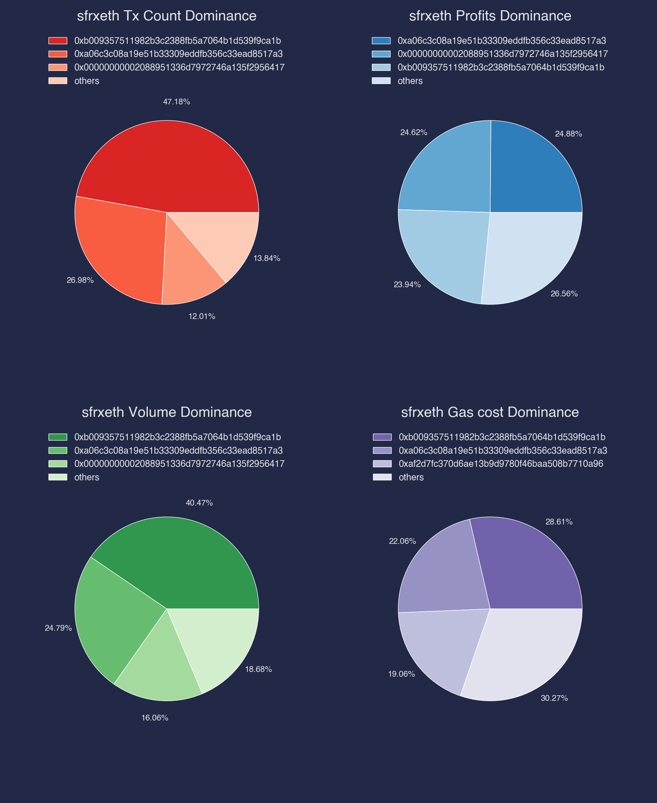
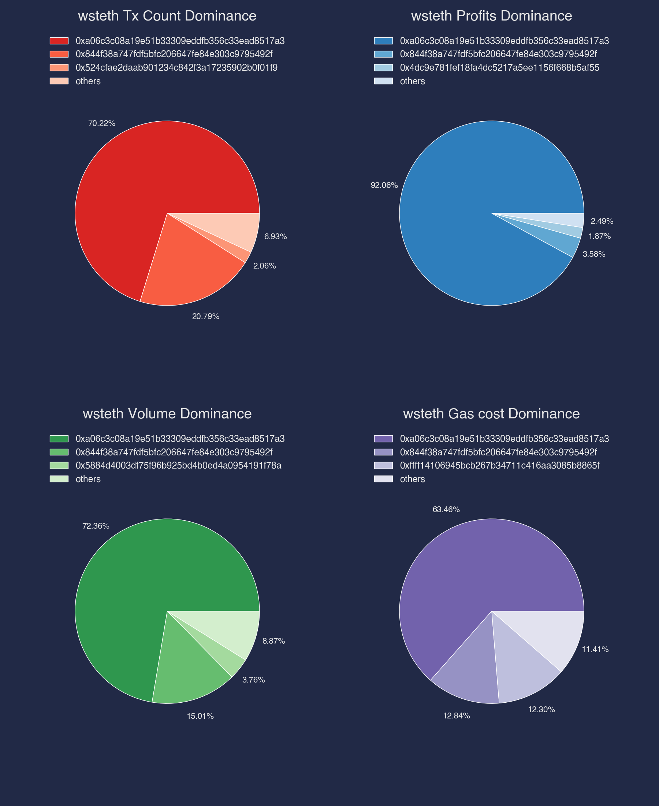
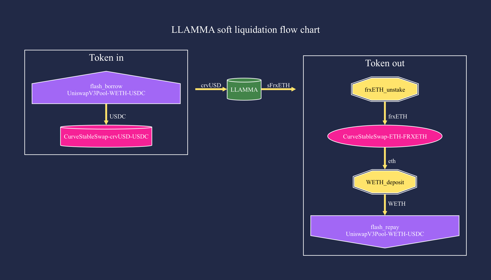
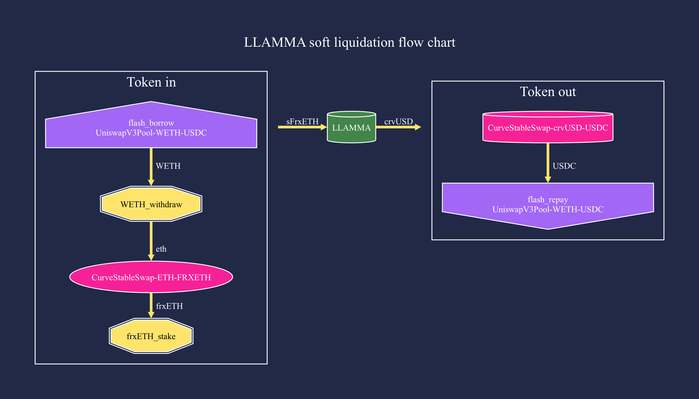
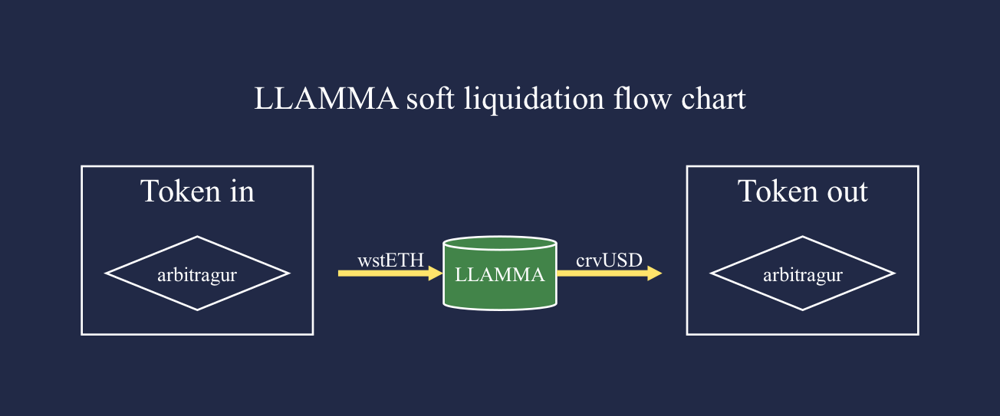
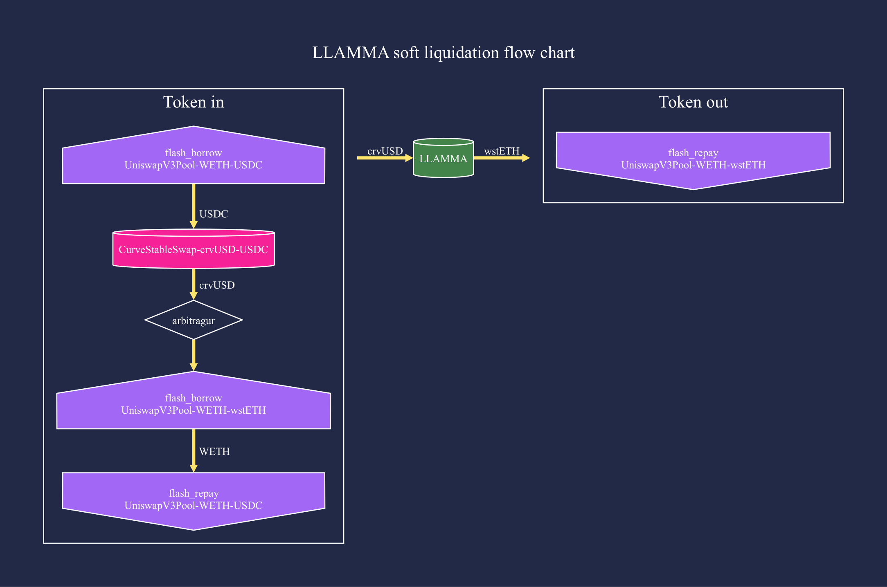
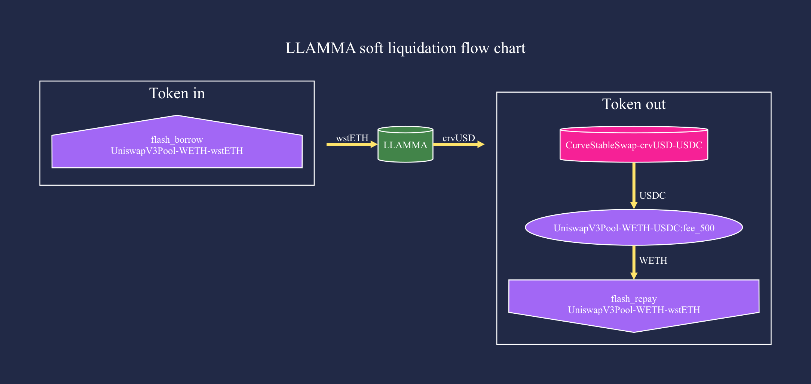

# crvUSD Arbitrage Analystics

This tool visualizes crvUSD LLAMMA pool's arbitraging process and conducts statistical analysis.

## Getting Started

- Install

```sh
poetry install
```

- Generate arbitrage tokenflow chart by transacation hash (dot file and png file)

```sh
poetry shell

python crvusd_arbitrage_analytics/tokenflow.py 0x0806a484daf46bf1948185fac7f13613268da0969d638bc87dc934eefeab6b13
```

## Basic Use

Fetch all arbitrage data and automatically classify, statistics, and generate tokenflow chart.

0. Fetch all arbitrage transacation data, and collateral price data, save raw data in `data/original`
1. Wash raw data, save csv file and json file in `data/detailed_trades_data_[collateral]`
   - Automatically identify the behavior type of each token transfer
   - Log all swap pools
   - Group all tx steps, e.g. flashswap, sFrxETH stake/unstake, WETH deposit/withdraw, token swap in/out
2. Classify all arbitrage tokenflow
3. Generate tokenflow chart for each arbitrage category
4. Generate statistical graphs

```sh
python scripts/0_fetch_data.py
python scripts/1_wash_data.py
python scripts/2_sort_data.py
python scripts/3_draw_graph.py
python scripts/4_statistics_data.py
```

## Results

Some statistical graphs and token flow charts (statistics date: 2023-07-05):

### Statistics

#### Daily revenue and gascost




#### revenue volume scatter





#### sFrxETH Dominance



#### wstETH Dominance



### Tokenflow

#### sFrxETH LLAMMA Pool

The three most frequently used arbitrage methods:

- Type A, example tx: `0x0806a484daf46bf1948185fac7f13613268da0969d638bc87dc934eefeab6b13`

  

- Type B, example tx: `0xb1e182dfae0a0c81d609385da915ae2e5b94eaebf4061b0291277dce3287d65a`

  

- Type C, example tx: `0x9332769f94c51f9be3dc185e54b9abe10119efcb1fe7dcbfb2177739ff9bc29c`

  

#### wstETH LLAMMA Pool

The three most frequently used arbitrage methods:

- Type A, example tx: `0xf8de27d0d1a8a66a561b2a71b5ff094d39c2a7f666fb8808ba6be940991a96b0`

  

- Type B, example tx: `0x0ac5408296a21b40f0510f9383494b9eae806d0fb7aff781d4a6243f8694dc3f`

  

- Type C, example tx: `0xb1e21a3b291f806542853521279a53d5a7b3680cbeb324c332526a12810b226b`

  

More data and picture results can be seen in [results folder](./results/).
