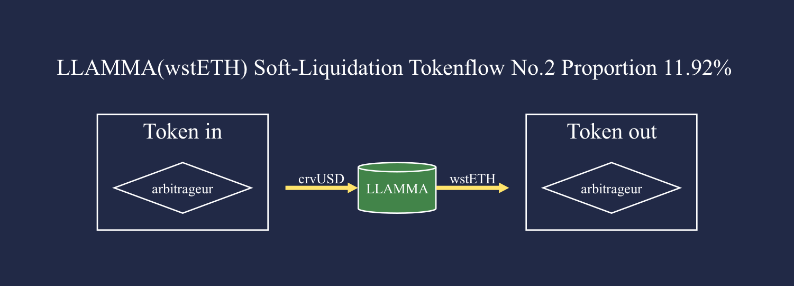
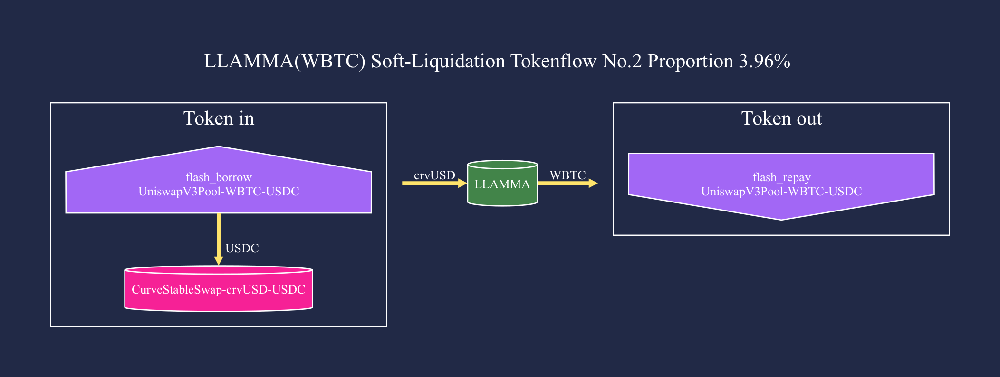

# crvUSD Arbitrage Analystics

This tool visualizes crvUSD LLAMMA pool's arbitraging process and conducts statistical analysis.

## Getting Started

- Install

```sh
poetry install
```

- Generate arbitrage tokenflow chart by transacation hash (dot file and png file)

```sh
poetry shell

python crvusd_arbitrage_analytics/tokenflow.py 0x0806a484daf46bf1948185fac7f13613268da0969d638bc87dc934eefeab6b13
```

## Basic Use

Fetch all arbitrage data and automatically classify, statistics, and generate tokenflow chart.

0. Fetch all arbitrage transacation data, and collateral price data, save raw data in `data/original`
1. Wash raw data, save csv file and json file in `data/csv/tokenflow_data_[collateral]`, `data/json/tokenflow_data_[collateral]`
   - Automatically identify the behavior type of each token transfer
   - Log all swap pools
   - Group all tx steps, e.g. flashswap, sFrxETH stake/unstake, WETH deposit/withdraw, token swap in/out
2. Classify all arbitrage tokenflow
3. Generate statistical graphs
4. Generate tokenflow chart for each arbitrage category

```sh
python scripts/0_fetch_data.py
python scripts/1_wash_data.py
python scripts/2_sort_data.py
python scripts/3_draw_graph.py
python scripts/4_statistics_data.py
```

## Results

Some statistical graphs and token flow charts (statistics date: 2023-07-15):

### Statistics

#### Daily revenue and gascost


#### revenue volume scatter


#### sFrxETH Dominance


#### wstETH Dominance


#### WBTC Dominance


#### WETH Dominance


### Tokenflow

#### sFrxETH LLAMMA Pool


The three most frequently used arbitrage methods:


#### wstETH LLAMMA Pool


The three most frequently used arbitrage methods:





#### WBTC LLAMMA Pool

The three most frequently used arbitrage methods:





#### WETH LLAMMA Pool

The three most frequently used arbitrage methods:


More data and picture results can be seen in [results folder](./results).
